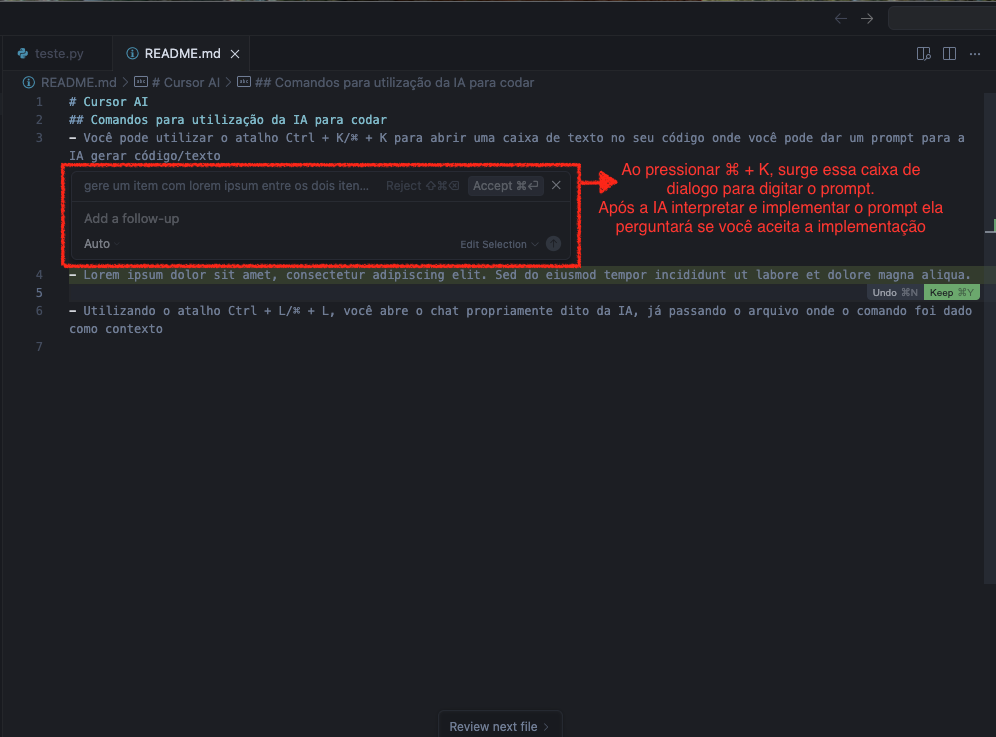
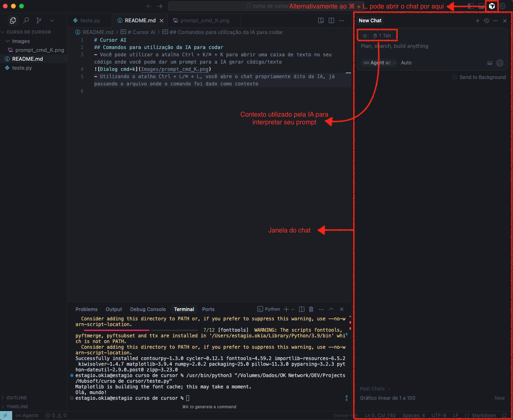
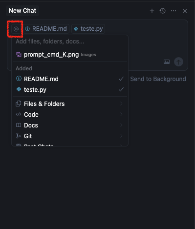
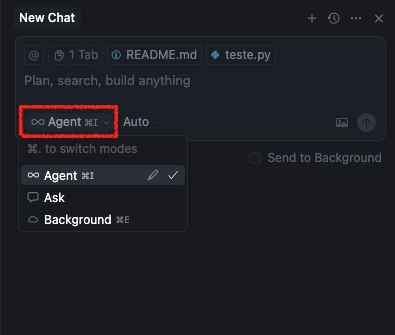
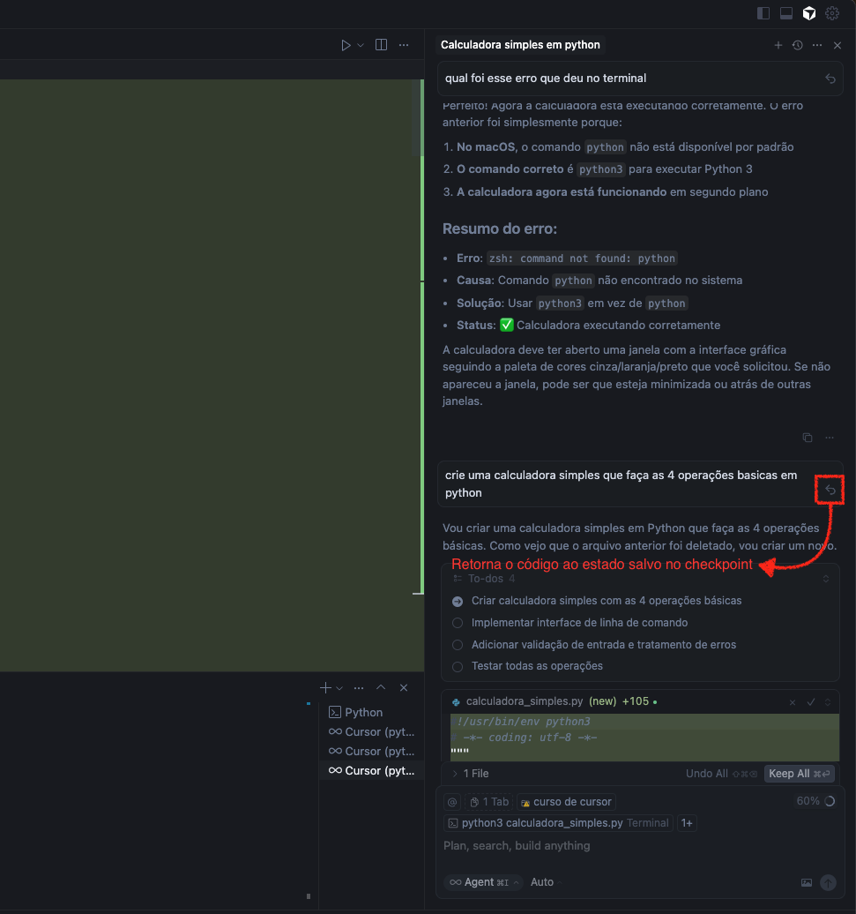

# Cursor AI
## Comandos para utilização da IA para codar
- Você pode utilizar o atalho Ctrl + K/⌘ + K para abrir uma caixa de texto no seu código onde você pode dar um prompt para a IA gerar código/texto

- Utilizando o atalho Ctrl + L/⌘ + L, você abre o chat propriamente dito da IA, já passando o arquivo onde o comando foi dado como contexto

- Também é possível adicionar mais fontes de contexto no ícone de "@" na janela do chat com a IA
    
    

- É possível definir o nível de autonomia da IA dentro do projeto, definí-la como "Agent" permite que a IA realize alterações no código e se adapte automaticamente às mudanças ocorridas
    
    

- Quando desistimos de alguma alteração, podemos retornar ao checkpoint que é criado automaticamente quando a IA gera código através de um prompt clicando no ícone de seta retornando
    
    

## Diferenciais da IDE Cursor AI
### 1.  Integração com outras plataformas
- Por meio dos Model Context Protocol (MCPs), o Cursor AI se conecta a repositórios, serviços de CI/CD e bibliotecas de análise de dados, tornando fácil disparar rotinas ou gerar relatórios sem sair do editor.
- A automação de processos externos acontece quase como um bate-papo: você diz o que precisa, e o Agent do Cursor AI gerencia os comandos.

### 2. Customização de comandos e fluxos
- A ferramenta não se limita a recursos pré-construídos: você pode criar comandos personalizados que chamam scripts, executam tarefas de limpeza ou formatam documentação.
- Ao digitar comandos como `/command` seguido da lógica desejada, o Cursor AI interpreta a ação e retorna resultados ou executa a tarefa

### 3. Escolha de Modelos de IA
- Em configurações específicas, é possível selecionar o modelo que será usado no chat ou nas sugestões de código.
- Alguns modelos são mais rápidos e econômicos em termos de recursos, enquanto outros oferecem maior profundidade de análise e correções.

## Opções/Modos de chat: Agent vs. Ask vs. Edit
### 1. Agent
- Funciona como um “agente de execução” mais avançado: além de sugerir códigos, o Agent é capaz de interpretar comandos e executar fluxos predefinidos.
- Exemplo: “Agent, crie um script Python que leia um arquivo CSV e gere um relatório em PDF.” Se houver MCPs ou configurações compatíveis, ele pode montar a base do código, abrir processos e até interagir com APIs externas.
### 2. Ask
- Ideal para perguntas diretas de programação e explicações.
- Você digita algo no modo Ask como: “Qual a melhor forma de lidar com exceções em Python?” e recebe uma resposta mais detalhada, sem que o sistema tente agir por si mesmo.
### 3. Edit
- Focado em ajustes pontuais, o modo Edit permite que você selecione um trecho de texto ou código e solicite ao Cursor AI reformular, resumir ou corrigir.
- Exemplo: “Edit: Corrigir ortografia neste trecho de documentação.” O sistema, então, revisa o conteúdo selecionado, mantendo o contexto e a coerência do que já foi produzido, mas sem desencadear nenhum processo de execução ou automação adicional.
### 4. Escolhendo Modelos
- Ao usar Agent ou Ask, você pode indicar o modelo no qual confia para cada tipo de tarefa no botão que fica ao lado da seleção de modo (Ask, Agent ou Edit).
- Como padrão esse botão inicia no modo Auto onde ele alterna entre os modelos de IA durante o uso de forma automática.

## Simbolos e comandos no Cursor AI
O Cursor AI fornece diversos símbolos e comandos especiais para enriquecer o contexto do Chat, do Composer ou do `Ctrl+K`/`⌘+K`. Com eles, é possível anexar arquivos, referências de código, integrações externas e muito mais, tornando o desenvolvimento mais dinâmico e automatizado.

Para acionar uma das funcionalidades embutidas, basta digitar @ e complementar com um dos seguintes comandos:

## `@files`:
Permite incluir arquivos inteiros como contexto no Chat ou no Composer.

- O Cursor exibe um preview do arquivo para você confirmar se é o correto.
- Se o arquivo for grande, ele é dividido em partes para análise.
- Você pode arrastar arquivos do painel lateral para o Chat/Composer.

## `@folders`:
Faz referência a pastas inteiras como contexto.

- Ao digitar @folders em modo Agent, o Cursor AI pode explorar todos os arquivos dentro de um diretório.
- Ótimo para projetos grandes, permitindo ao Agent analisar diversos arquivos e encontrar soluções ou dependências relacionadas.

## `@code`:
Destaque de trechos específicos de código dentro de um arquivo.

- O Cursor mostra o snippet, garantindo que você saiba exatamente qual bloco está sendo referenciado.
- Você pode selecionar um trecho no editor e usar “Add to Chat” ou “Add to Edit” para enviar diretamente ao Chat/`Ctrl+K`/`⌘+K`.

## `@docs`
Permite incluir arquivos de documentação (como README.md, docs técnicos, etc.) como contexto para a AI.

- Similar ao @files, mas específico para arquivos de documentação do projeto ou bibliotecas externas.
- Ajuda a AI a entender melhor o contexto através da documentação, seja do projeto ou de libs adicionadas manualmente.
- Aceita documentações locais em diversos formatos como markdown, txt, etc.

## `@git`
Permite incluir informações de alterações do git (como diffs) como contexto para a AI.

- Ajuda na análise de mudanças específicas no código.
- Útil para revisão de código e entendimento de alterações.

## `@web`
Permite incluir resultados de buscas web como contexto para a AI.

- Ajuda a fornecer informações atualizadas ou documentação externa para a AI.
- Usa informações web previamente fornecidas como contexto.

## `@definitions`
Permite incluir definições de código (classes, funções, variáveis) como contexto para a AI.

- Ajuda a AI a entender o código relacionado e suas dependências.
- Útil para fornecer informações sobre a estrutura e relações do código.
- O comando é especialmente útil quando você precisa que a AI entenda como diferentes partes do código se relacionam, mas não precisa incluir todo o arquivo.

## `@https://qualquerurl.dominio`
Permite incluir links como contexto no chat do Cursor

- Cole um URL e ele será automaticamente convertido em um @link.
- Você pode clicar em “Unlink” para remover a formatação.
- Ao segurar Shift para colar você mantéma URL como texto simples.
- Permite adicionar imagens e outros contextos junto com o link.

## `@lint errors`
Lista erros de lint detectados em seu projeto como contexto para o Chat/Composer.

- Ajuda a identificar e corrigir problemas de estilo ou sintaxe no código.
- Muito útil quando você quer que a AI ajude a corrigir problemas de lint no seu código, fornecendo o contexto necessário dos erros encontrados.

## `@recent changes`
Permite acessar alterações recentes no código como contexto.

- Ajuda a AI a entender as modificações mais recentes no projeto.
- A AI entende o contexto das mudanças recentes, seja para revisão de código ou para continuar um trabalho em andamento.

## `@cursor rules`
Permite acessar e trabalhar com as regras personalizadas do Cursor.

- Aplica regras específicas do projeto que guiam o comportamento da AI
- Pode incluir normas de estilo, convenções de código e outras diretrizes do projeto.
- As Cursor Rules podem ser definidas de duas formas:
    - Globalmente nas configurações do Cursor;
    - Por projeto usando arquivos .mdc no diretório `.cursor/rules.`

## `@notepads`
Referencia bloquinhos de anotações criados no Cursor, que podem ser trocados entre Chat e Composer.

- Armazena snippets, lembretes ou rascunhos temporários.
- É uma funcionalidade _**<u>beta</u>**_ que permite manter anotações separadas dos arquivos de código, útil para armazenar informações temporárias ou referências que você quer manter à mão durante o desenvolvimento.

## `@summarized composers`
Permite acessar e referenciar resumos de sessões anteriores do Composer.

- Ajuda a retomar contextos de discussões ou trabalhos anteriores.
- Evita repetir explicações longas ao continuar um trabalho complexo.
- Útil quando você está trabalhando em projetos longos ou complexos e precisa manter o contexto entre diferentes sessões de trabalho no Composer.

## `#[nome do arquivo]`
Seleciona arquivos específicos usando o prefixo # nos campos de entrada do Cursor.

- Digite # seguido do nome do arquivo para focar em arquivos específicos.
- Funciona em conjunto com símbolos @ para controle preciso de contexto.

## `/command`
Referencia abas abertas do editor e as adiciona como contexto para conversas com o Cursor AI.

- Opções:
    - “Reset context”: Limpa todo o contexto atual
    - “Add open files to context”: Adiciona todos os arquivos abertos
    - “Add active files to context”: Adiciona apenas os arquivos ativos/visíveis
    - Digite `/` para acessar estas opções de gerenciamento de contexto.

## Ignore files
Para controlar o acesso e a indexação de arquivos no Cursor AI, você pode criar dois arquivos de configuração na raiz do seu projeto, de forma semelhante ao `.gitignore`:
### 1. `.cursorignore`
- Função: Excluir arquivos tanto das funcionalidades de IA quanto da indexação.
- Uso Recomendado: Para arquivos sensíveis ou confidenciais que não devem aparecer em contexto algum.
- Observação: É um sistema best-effort — não há garantia de 100% de bloqueio, mas a equipe do Cursor AI se empenha em corrigir eventuais falhas.
- Efeitos nos Arquivos Listados Aqui:
    - Não aparecem em abas ou chat.
    - Não são incluídos como contexto de IA.
    - Não são indexados para buscas.
    - Não ficam disponíveis por meio de `@-symbols`.

### 2. `.cursorindexignore`
- Função: Controlar apenas a indexação de arquivos para busca e contexto — sem impedir acesso manual, se o usuário escolher adicioná-los ao chat/composer.
- Herança: Automaticamente inclui padrões já definidos no `.gitignore`.
- Uso Típico:
    - Excluir grandes arquivos gerados (logs, binários etc.) da indexação.
    - Evitar que a indexação fique sobrecarregada, mantendo apenas o essencial para pesquisas.
- Sintaxe: mesma do `.gitignore`

### 3. Observações importantes
- Crie ambos os arquivos na raiz do seu projeto, ou em subpastas específicas, se quiser configurar regras locais.
- Os padrões de exclusão funcionam seguindo a lógica tradicional de .gitignore, incluindo suporte a wildcards, negações, e consideração de caminhos relativos.

## O que é o Model Context Protocol (MCP)?
O MCP é uma espécie de “conector” ou “módulo” que ensina o Cursor AI a se comunicar com outros serviços sem exigir que você mesmo programe cada detalhe de autenticação, formatação de requisições ou endpoint. Em outras palavras, ele dá à IA a capacidade de entender e agir sobre determinado serviço, seguindo regras e fluxos pré-configurados.

- **Exemplo prático**: Em vez de sair do editor e acessar o site do GitHub para abrir um Pull Request, você pode simplesmente dizer “Agent, abra uma Pull Request na branch main” caso o MCP GitHub esteja ativo. Todo o processo (token, montagem de requisição, envio de dados) ocorre nos bastidores, de forma unificada.

### Como surgiu e por que é importante?
1. Demanda de Automação

    Desenvolvedores queriam um jeito de disparar ações (como criar issues, enviar e-mails, fazer deploy) sem precisar de scripts específicos ou trocar de ferramentas. O MCP surgiu como solução para padronizar esse tipo de comunicação.

2. Abordagem de IA Contextual
    
    O Cursor AI busca manter o contexto de cada conversa, assim como ferramentas modernas de IA fazem. O MCP reforça isso ao permitir que a IA “lembre” como interagir com determinado serviço, sem que o usuário repita parâmetros técnicos em toda nova requisição.
3. Economia de Tempo e Redução de Erros

    Com o MCP, a lógica de requisição e autenticação fica encapsulada. Quando algo muda na API ou serviço externo, basta atualizar o MCP. Todos os usuários do Cursor AI continuam trabalhando normalmente, sem precisar ajustar scripts manualmente.
